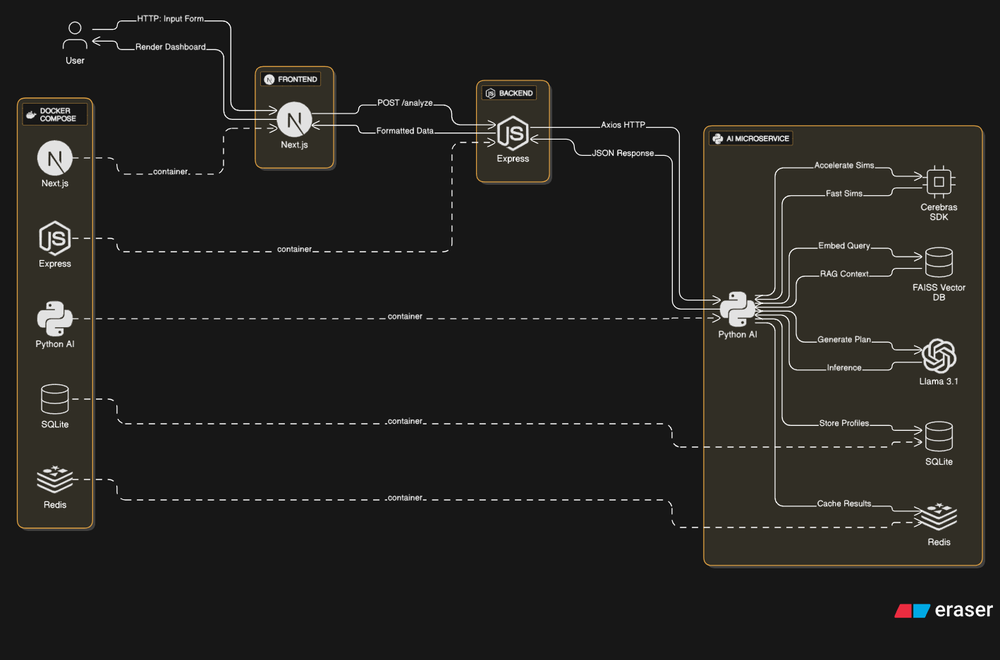
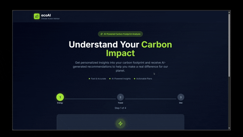

# EcoAI: GenAI-Powered Climate Action Advisor
EcoAI is an interactive web platform developed for the FutureStack GenAI hackathon (Sept 29 - Oct 5, 2025). It empowers users to reduce their carbon footprint through AI-driven insights, personalized sustainability plans, and real-time "what-if" simulations. Built with Next.js, Node.js/Express, Meta's Llama 3.1, Cerebras, and Docker, ecoAI combines cutting-edge AI with a polished UX to make climate action accessible.

## Features
- Input daily habits (energy use, travel, diet) for carbon footprint analysis
- Generate tailored sustainability plans using Llama 3.1
- Run real-time simulations with Cerebras-accelerated inference
- Interactive dashboards with Recharts visualizations
- Dockerized deployment for scalability

## Tech Stack
- **Frontend:** Next.js 14.x
- **Backend:** Node.js 20.x with Express
- **AI Service:** Python3.9+, Llama 3.1 (Hugging Face), Cerebras SDK, LangChain, Hugging Face Embeddings, FAISS

## Setup Instructions
1. Clone: `git clone https://github.com/mdkamranalam/EcoAI.git`.
2. Install:
   - Frontend: `cd frontend; npm install`.
   - Backend: `cd backend; npm install`.
   - AI: `cd ai-service; pip install -r requirements.txt`.
3. Set env: 
   - In root directory: env.example content (copy to .env and fill values in `HF_TOKEN` and `CEREBRAS_API_KEY`).
   - Frontend: env.example content (copy to .env and fill value in `NEXT_PUBLIC_API_URL=http://localhost:3001`).
   - Backend: env.example content (copy to .env and fill value in `AI_URL=http://127.0.0.1:8000`).
4. Run:
   - AI Service: `cd ai-service; unicorn app:app --reload --port 8000` (Make sure AI service is running on port 8000).
   - Backend: `cd backend; npm run dev` (Make sure backend is running on port 3001).
   - Frontend: `cd frontend; npm run dev` (Make sure frontend is running on port 3000).
5. Access the app at `http://localhost:3000`.

## Architecture Diagram
  
_Diagram created with Draw.io, showing Next.js → Express → Python AI flow._

## Project Demo Video

## Usage
1. Enter daily habits (e.g., kWh usage, miles traveled) on the homepage
2. Submit to receive a carbon footprint analysis and personalized plan
3. Explore "what-if" simulations for greener choices
4. You can also able to download the report in PDF format

## Learning & Growth
As a team, we tackled Cerebras' SDK for the first time, cutting inference from 10s to <1s with batching optimizations. LangChain's RAG was a new tool, enabling cited responses in hours. Docker networking challenges taught us robust service isolation, boosting our DevOps skills.

EcoAI is our bid to make climate action personal and impactful. Let's build a greener future! 🌍 #FutureStackGenAI